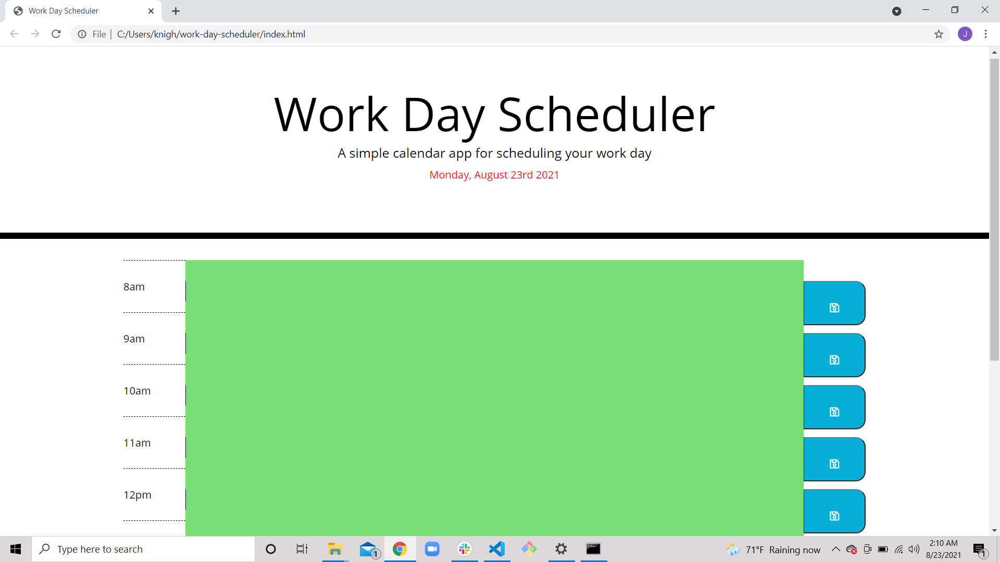

# work-day-scheduler

## Description

- The motivation behind this project was to create a work day schedule revolving around daily business hours. 

- This project was built to keep our work day organized

- The problem that this project solves is that it will prevent people from forgetting what they have planned for the day. They may also need to jot down something new they need to do. 

- I learned that you can utilize columns to give a webpage structure. 

## Usage

https://jordan1570.github.io/work-day-scheduler/

https://github.com/Jordan1570/work-day-scheduler

- The workday planner is set from 8am to 5pm.

- The current hour in the work day will display red.

- The hours that have passed will display grey.

- The hours that are coming up will display green. 

- You can input text between the time and the save button. 

- After you input text into the text area, press the save button. It will save whatever you input into local storage. 

